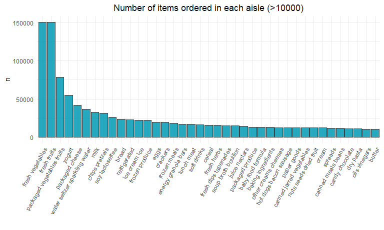
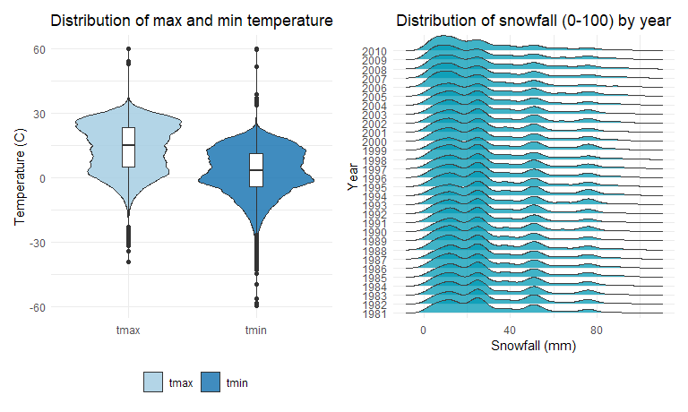

Homework 3 solutions
================
Wenhao Gou

## 0\. Global settings:

``` r
library(tidyverse)
library(p8105.datasets)
library(lubridate) # For cleaning date object
library(patchwork)
library(ggridges)

knitr::opts_chunk$set(
  fig.width = 8, 
  fig.asp = .6,
  out.width = "90%"
)
theme_set(theme_minimal() + 
            theme(legend.position = "bottom") +
            theme(plot.title = element_text(hjust = 0.5)))
options(
  ggplot2.continuous.colour = "viridis",
  ggplot2.continuous.fill = "viridis"
)
```

### 1\. Problem 1

#### 1.1 Import the dataset and general overview:

``` r
data("instacart")
instacart
## # A tibble: 1,384,617 x 15
##    order_id product_id add_to_cart_ord~ reordered user_id eval_set order_number
##       <int>      <int>            <int>     <int>   <int> <chr>           <int>
##  1        1      49302                1         1  112108 train               4
##  2        1      11109                2         1  112108 train               4
##  3        1      10246                3         0  112108 train               4
##  4        1      49683                4         0  112108 train               4
##  5        1      43633                5         1  112108 train               4
##  6        1      13176                6         0  112108 train               4
##  7        1      47209                7         0  112108 train               4
##  8        1      22035                8         1  112108 train               4
##  9       36      39612                1         0   79431 train              23
## 10       36      19660                2         1   79431 train              23
## # ... with 1,384,607 more rows, and 8 more variables: order_dow <int>,
## #   order_hour_of_day <int>, days_since_prior_order <int>, product_name <chr>,
## #   aisle_id <int>, department_id <int>, aisle <chr>, department <chr>
```

This dataset contains 1384617 rows and 15 columns.

Observations are the level of items in orders by user. There are user /
order variables – user ID, order ID, order day, and order hour. There
are also item variables – name, aisle, department, and some numeric
codes. Deatiled description of the dataset can be found
[here](https://p8105.com/dataset_instacart.html)

#### 1.2 Answer of the following questions:

  - How many aisles are there, and which aisles are the most items
    ordered from?

<!-- end list -->

``` r
instacart %>% 
    count(aisle) %>% 
    arrange(desc(n))
## # A tibble: 134 x 2
##    aisle                              n
##    <chr>                          <int>
##  1 fresh vegetables              150609
##  2 fresh fruits                  150473
##  3 packaged vegetables fruits     78493
##  4 yogurt                         55240
##  5 packaged cheese                41699
##  6 water seltzer sparkling water  36617
##  7 milk                           32644
##  8 chips pretzels                 31269
##  9 soy lactosefree                26240
## 10 bread                          23635
## # ... with 124 more rows
```

We can see that, there are `134` aisles in total. The aisle which have
the largest order number is the fresh vegetables aisle.

  - Make a plot that shows the number of items ordered in each aisle,
    limiting this to aisles with more than 10000 items ordered. Arrange
    aisles sensibly, and organize your plot so others can read it.

<!-- end list -->

``` r
instacart %>% 
    count(aisle) %>% 
    filter(n > 10000) %>% 
    mutate(
        aisle = factor(aisle),
        aisle = fct_reorder(aisle, -n)
    ) %>% 
  ggplot(aes(x = aisle, y = n)) + 
  geom_bar(stat = "identity", alpha = 0.85, color = "#424242", fill = "#0099B4") +
  theme(axis.text.x = element_text(angle = 60, vjust = 1, hjust = 1)) +
  ggtitle ( "Number of items ordered in each aisle (>10000)") +
  xlab("")
```



  - Make a table showing the three most popular items in each of the
    aisles “baking ingredients”, “dog food care”, and “packaged
    vegetables fruits”. Include the number of times each item is ordered
    in your table.

<!-- end list -->

``` r
instacart %>% 
    filter(aisle %in% c("baking ingredients", "dog food care", "packaged vegetables fruits")) %>% 
    group_by(aisle) %>% 
    count(product_name) %>% 
    mutate(rank = min_rank(desc(n))) %>% 
    filter(rank < 4) %>% 
    arrange(aisle, rank) %>% 
    knitr::kable()
```

| aisle                      | product\_name                                 |    n | rank |
| :------------------------- | :-------------------------------------------- | ---: | ---: |
| baking ingredients         | Light Brown Sugar                             |  499 |    1 |
| baking ingredients         | Pure Baking Soda                              |  387 |    2 |
| baking ingredients         | Cane Sugar                                    |  336 |    3 |
| dog food care              | Snack Sticks Chicken & Rice Recipe Dog Treats |   30 |    1 |
| dog food care              | Organix Chicken & Brown Rice Recipe           |   28 |    2 |
| dog food care              | Small Dog Biscuits                            |   26 |    3 |
| packaged vegetables fruits | Organic Baby Spinach                          | 9784 |    1 |
| packaged vegetables fruits | Organic Raspberries                           | 5546 |    2 |
| packaged vegetables fruits | Organic Blueberries                           | 4966 |    3 |

  - Make a table showing the mean hour of the day at which Pink Lady
    Apples and Coffee Ice Cream are ordered on each day of the week;
    format this table for human readers (i.e. produce a 2 x 7 table)

<!-- end list -->

``` r
instacart %>% 
    filter(product_name %in% c("Pink Lady Apples", "Coffee Ice Cream")) %>% 
    group_by(product_name, order_dow) %>% 
    summarize(mean_hour = mean(order_hour_of_day)) %>% 
    pivot_wider(
        names_from = order_dow,
        values_from = mean_hour
    )
```

    ## # A tibble: 2 x 8
    ## # Groups:   product_name [2]
    ##   product_name       `0`   `1`   `2`   `3`   `4`   `5`   `6`
    ##   <chr>            <dbl> <dbl> <dbl> <dbl> <dbl> <dbl> <dbl>
    ## 1 Coffee Ice Cream  13.8  14.3  15.4  15.3  15.2  12.3  13.8
    ## 2 Pink Lady Apples  13.4  11.4  11.7  14.2  11.6  12.8  11.9

### 2\. Problem 2

This problem uses five weeks of accelerometer data collected on a 63
year-old male with BMI 25, who was admitted to the Advanced Cardiac Care
Center of Columbia University Medical Center and diagnosed with
congestive heart failure (CHF). The data can be downloaded
[here](https://p8105.com/data/accel_data.csv). In this spreadsheet,
**variables activity.\* are the activity counts for each minute of a
24-hour day starting at midnight.**

#### 2.1 Load and tidy the dataset

Load, tidy, and otherwise wrangle the data. Your final dataset should
include all originally observed variables and values; have useful
variable names; include a weekday vs weekend variable; and encode data
with reasonable variable classes. Describe the resulting dataset
(e.g. what variables exist, how many observations, etc).

``` r
acc <- read_csv("accel_data.csv") %>%
  janitor::clean_names() %>%
  mutate(day_type = case_when(
    day == "Saturday" ~ "weekend",
    day == "Sunday"   ~ "weekend",
    TRUE              ~ "weekday"
  )) %>%
  pivot_longer(activity_1:activity_1440,
               names_to = "minutes",
               names_prefix = "activity_",
               values_to = "value") %>%
  mutate(minutes = as.numeric(minutes)) %>%
  rename("week_id" = week)
acc
```

    ## # A tibble: 50,400 x 6
    ##    week_id day_id day    day_type minutes value
    ##      <dbl>  <dbl> <chr>  <chr>      <dbl> <dbl>
    ##  1       1      1 Friday weekday        1  88.4
    ##  2       1      1 Friday weekday        2  82.2
    ##  3       1      1 Friday weekday        3  64.4
    ##  4       1      1 Friday weekday        4  70.0
    ##  5       1      1 Friday weekday        5  75.0
    ##  6       1      1 Friday weekday        6  66.3
    ##  7       1      1 Friday weekday        7  53.8
    ##  8       1      1 Friday weekday        8  47.8
    ##  9       1      1 Friday weekday        9  55.5
    ## 10       1      1 Friday weekday       10  43.0
    ## # ... with 50,390 more rows

After clean and reformat the dataset, the resulting table have `6`
variables with `50390` observations. In these 6 variable, the `week_id`
indicate the id of the week of the observation, ranging from week 1 to
5. The `day_id` indicate the day number in the record, ranging from 1 to
35 (5 weeks). The variable `day` and `day_type` indicate the information
of the day. The variable `minutes` indicate which minutes the
observation was in (in each day, there are 1440 minutes). The final
variable `value` indicate the recorded value of the accelerometer.

#### 2.2 Make a table

Traditional analyses of accelerometer data focus on the total activity
over the day. Using your tidied dataset, aggregate across minutes to
create a total activity variable for each day, and create a table
showing these totals. Are any trends apparent?

``` r
acc_table <-
  acc %>%
  mutate(day = forcats::
           fct_relevel(day, c("Monday", "Tuesday", "Wednesday", 
                              "Thursday", "Friday", "Saturday", "Sunday"))) %>%
  group_by(week_id, day) %>%
  summarise(total_activity = sum(value))
```

This table is till not that easy for us to analyze. To further tidy this
table, we can do the following steps:

``` r
acc_table %>% pivot_wider(names_from = week_id,
              values_from = total_activity) %>%
  knitr::kable(align = "r", 
               digits = 0,
               col.names = c("Week No.",1:5))
```

|  Week No. |      1 |      2 |      3 |      4 |      5 |
| --------: | -----: | -----: | -----: | -----: | -----: |
|    Monday |  78828 | 295431 | 685910 | 409450 | 389080 |
|   Tuesday | 307094 | 423245 | 381507 | 319568 | 367824 |
| Wednesday | 340115 | 440962 | 468869 | 434460 | 445366 |
|  Thursday | 355924 | 474048 | 371230 | 340291 | 549658 |
|    Friday | 480543 | 568839 | 467420 | 154049 | 620860 |
|  Saturday | 376254 | 607175 | 382928 |   1440 |   1440 |
|    Sunday | 631105 | 422018 | 467052 | 260617 | 138421 |

Form the table, we can see that, in general, there are no apparent trend
in the data. It is only noticeable that in week no. 4 and 5, on
Saturday, the observed individual have a significant low level of
activity level compared to other days within that week and between each
weeks.

### 2.3 Make a plot

Accelerometer data allows the inspection activity over the course of the
day. Make a single-panel plot that shows the 24-hour activity time
courses for each day and use color to indicate day of the week. Describe
in words any patterns or conclusions you can make based on this graph.

``` r
acc %>%
  mutate(day = forcats::
           fct_relevel(day, c("Monday", "Tuesday", "Wednesday", 
                              "Thursday", "Friday", "Saturday", "Sunday")))  %>%
  mutate(hour = (minutes - 1) %/% 60) %>%
  group_by(day, day_id, hour) %>%
  summarise(total_activity_day = mean(value)) %>%
  ggplot(aes(x = hour, y = total_activity_day, group = day_id)) +
  scale_color_brewer(palette = "Paired") +
  #scale_colour_viridis_d(option = "D", end = 0.65, direction = -1) +
  xlim(0, 23) +
  geom_line(aes(color = day), size = 0.75) +
  labs(title = "Daily activity manner") + 
  xlab("Time (h)") + 
  ylab("Average activity level") +
  theme(legend.title = element_blank())
```


From the plot, we can see that, for each day of the week, the observed
person was in low activity level form 23:00 to 5:00. After that, the
activity level of this people leaped and fluctuated until 20 :00. But it
is noticeable that, on Sundays, the activity level of this people is
higher than other days in the week from 8:00 to 13:00 and lower after
19:00. Also, on Fridays, the activity level of this people is higher
than other days in the week from 18:00 to 22:00.

### 3\. Problem 3

#### 3.1 Import and clean the dataset

Do some data cleaning. Create separate variables for year, month, and
day. Ensure observations for temperature, precipitation, and snowfall
are given in reasonable units. For snowfall, what are the most commonly
observed values? Why?

``` r
# Import and clean the data:

data("ny_noaa")
ny_clean <- ny_noaa %>% 
  mutate(year = year(date),
         month = month(date), 
         day = day(date)) %>%
  mutate(tmax = as.numeric(tmax)/10,
         tmin = as.numeric(tmin)/10) %>%
  select(id:date, year:day, everything())
ny_clean
```

    ## # A tibble: 2,595,176 x 10
    ##    id          date        year month   day  prcp  snow  snwd  tmax  tmin
    ##    <chr>       <date>     <dbl> <dbl> <int> <int> <int> <int> <dbl> <dbl>
    ##  1 US1NYAB0001 2007-11-01  2007    11     1    NA    NA    NA    NA    NA
    ##  2 US1NYAB0001 2007-11-02  2007    11     2    NA    NA    NA    NA    NA
    ##  3 US1NYAB0001 2007-11-03  2007    11     3    NA    NA    NA    NA    NA
    ##  4 US1NYAB0001 2007-11-04  2007    11     4    NA    NA    NA    NA    NA
    ##  5 US1NYAB0001 2007-11-05  2007    11     5    NA    NA    NA    NA    NA
    ##  6 US1NYAB0001 2007-11-06  2007    11     6    NA    NA    NA    NA    NA
    ##  7 US1NYAB0001 2007-11-07  2007    11     7    NA    NA    NA    NA    NA
    ##  8 US1NYAB0001 2007-11-08  2007    11     8    NA    NA    NA    NA    NA
    ##  9 US1NYAB0001 2007-11-09  2007    11     9    NA    NA    NA    NA    NA
    ## 10 US1NYAB0001 2007-11-10  2007    11    10    NA    NA    NA    NA    NA
    ## # ... with 2,595,166 more rows

The cleaned dataset have 10 variables with 2595176 observations. The
first observation `id` indicate the id of the weather station. The other
4 variables after it indicate the date information, range from 1981.1.1
to 2010.12.31. The variable `prcp` indicate the precipitation in tenths
of mm, `snow` and `snwd` indicated the snowfall and snow depth in mm,
`tmax` and `tmin` indicate the maximum and minimum temperature.

``` r
# Statistics of the missing value:
tibble(prcp = sum(is.na(pull(ny_clean, prcp))) / 25951.76,
       snow = sum(is.na(pull(ny_clean, snow))) / 25951.76,
       snwd = sum(is.na(pull(ny_clean, snwd))) / 25951.76,
       tmax = sum(is.na(pull(ny_clean, tmax))) / 25951.76,
       tmin = sum(is.na(pull(ny_clean, tmin))) / 25951.76) %>%
  pivot_longer(prcp:tmin,
               names_to = "Variable" , 
               values_to = "Missing (%)") %>%
  knitr::kable()
```

| Variable | Missing (%) |
| :------- | ----------: |
| prcp     |     5.61958 |
| snow     |    14.68960 |
| snwd     |    22.80331 |
| tmax     |    43.71025 |
| tmin     |    43.71264 |

We can inspect the percentage of missing value for these variables. We
can see that, for each of the variable , there are at least 5 percentage
of missing value. For the variable `tmin` and `tmax`, there are even
greater than 40% percentage of missing value.

``` r
# Most commonly observed value in snowfall (excluded NA)

table(pull(ny_clean,snow)) %>%
  as.data.frame() %>%
  as_tibble() %>%
  arrange(desc(Freq)) %>%
  select(observation = Var1, frequency = Freq)
```

    ## # A tibble: 281 x 2
    ##    observation frequency
    ##    <fct>           <int>
    ##  1 0             2008508
    ##  2 25              31022
    ##  3 13              23095
    ##  4 51              18274
    ##  5 76              10173
    ##  6 8                9962
    ##  7 5                9748
    ##  8 38               9197
    ##  9 3                8790
    ## 10 102              6552
    ## # ... with 271 more rows

The commonly observed value in snowfall (exclude NA) is 0. This result
is reasonable, because only winter will snow.

#### 3.2 Plots

  - Make a two-panel plot showing the average max temperature in January
    and in July in each station across years. Is there any observable /
    interpretable structure? Any outliers?

<!-- end list -->

``` r
ny_clean %>%
  select(id, year, month, tmax) %>%
  filter(month %in% c(1,7)) %>%
  group_by(id, year, month) %>%
  summarise(aver_tmax = mean(tmax, na.rm = T)) %>%
  ggplot(aes(y = aver_tmax, x = year, color = id)) +
  facet_grid(month~., scales = "free") +
  viridis::scale_color_viridis(discrete = T, option = "A") +
  geom_point(size = 0.5) + 
  geom_path(alpha = 0.5) +
  ggtitle("Average maximum temperature among defferent weather stations cross years") +
  ylab("Average maximum temperature") +
  xlab("Year") +
  theme(legend.position = "none") 
```


We can see that, in general, the error of the average temperature across
each station is within 10C. There are just some of outlier in the plot
(e.g. 1988 Jun). In general, the mximum tempearture fluctuated each year
and stay around -2.5C in Jan and 27.5 in Jun. 

  - Make a two-panel plot showing (i) tmax vs tmin for the full dataset
    (note that a scatterplot may not be the best option); and (ii) make
    a plot showing the distribution of snowfall values greater than 0
    and less than 100 separately by year.

<!-- end list -->

``` r
p1 <-
  ny_clean %>% 
  select(tmax, tmin) %>%
  pivot_longer(tmax:tmin,
               names_to = "group",
               values_to = "temp") %>%
  ggplot(aes(x = group, y = temp, fill = group)) + 
  geom_violin(alpha = 0.85, size = 0.5) + 
  scale_fill_brewer(palette = "Paired") +
  geom_boxplot(width=0.1, fill = "white") +
  ggtitle("Distribution of max and min temperature") + 
  ylab("Temperature (C)") +
  xlab("") +
  theme(legend.title = element_blank())

p2 <- 
  ny_clean %>% 
  select(year, snow) %>%
  filter(snow > 0) %>%
  filter(snow <100)%>%
  mutate(year = as.factor(year)) %>%
  ggplot(aes(x= snow, y = year)) + 
  geom_density_ridges(alpha = 0.75, color = "#424242", fill = "#0099B4") + 
  ggtitle("Distribution of snowfall (0-100) by year") +
  xlab("Snowfall (mm)") +
  ylab("Year")

p1 + p2
```



We can see that, for the temperature of New York, the median of the
maximum temperature is around 20 and minimum temperature is around 0.
Also, the distribution of the maximum temperature tend to be left skewed
and distribution of the minimum temperate seems to be right skewed. For
the distribution of snowfall, we can see that the most common level of
snowfall is around 10mm and 28mm. Also, there may be some extreme year
that the snowfall level is around 50mm and 78mm. As time goes by, the
amount of snowfall tends to decrease as each peak in the plot seems to
be shorter and the main peak seemed to be moved leftward.
